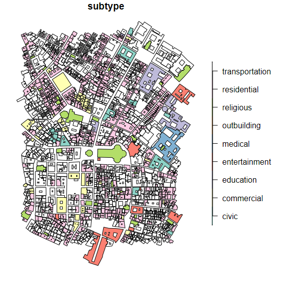

# overtureR
 Interface to Overture Open Data with R. 

# Installation

```R
devtools::install_github("jfulponi/overtureR")
```

# Usage

```R
library(overtureR)
library(sf)

get_all_overture_types()
```

```R
 [1] "address"           "bathymetry"        "building"         
 [4] "building_part"     "division"          "division_area"    
 [7] "division_boundary" "place"             "segment"          
[10] "connector"         "infrastructure"    "land"             
[13] "land_cover"        "land_use"          "water"    
```

```R
duomo_coords <- c(11.2558, 43.7739)

buffer_distance <- 0.005

duomo_bbox <- st_bbox(c(
  xmin = duomo_coords[1] - buffer_distance,
  ymin = duomo_coords[2] - buffer_distance,
  xmax = duomo_coords[1] + buffer_distance,
  ymax = duomo_coords[2] + buffer_distance
), crs = 4326)

data <- overture_sf("building", bbox = duomo_bbox)

plot(data["subtype"])

```


